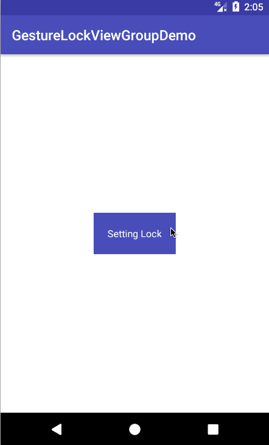

## GestureLockViewGroup
[](https://jitpack.io/#geek5nan/GestureLockViewGroup)

### 介绍
**GestureLockViewGroup**是一个基于[GestureLock](https://github.com/autume/GestureLock.git)重构的手势锁控件，目的是打造一个高内聚，低耦合，易于扩展的控件

>### 原项目特性
* 支持手势密码的绘制，并支持密码保存功能，解锁时自动比对密码给出结果
* 封装了绘制密码的方法，比对两次密码是否一致，可以快捷地进行手势密码的设置
* 可以设置密码输入错误后的重试次数上限
* 可以自定义不同状态下手势密码图案的颜色
* 可以自定义手势密码的触摸点数量（n*n）

### 功能改动
* 抽象密码功能，提供密码CURD接口，并内置了一个基于SharePreference的实现类
* 抽象节点视图类，并内置了基于Draw方法和图片的实现类
* 抽象创建节点视图功能，提供创建接口，并内置了两个基于构建者模式的节点视图Provider
* 调整密码设置、密码验证接口，便于扩展
* 新增指引线宽度设置
* 为便于阅读及修改源码，移除了大量冗余变量并添加了大量注释

### Demo演示


### 使用方式
#### 简单应用
##### 1.添加GestureLockViewGroup


属性名称|含义|默认值|可选项
---|---|---|---
app:color_default|默认颜色|0xFF858585|✅
app:color_moving|输入密码时的颜色|0XFF00A6EF|✅
app:color_incorrect|密码错误时的颜色|0xFF91DC5A|✅
app:color_correct|密码正确时的颜色|0xFFFF0000|✅
app:count|每行每列节点视图个数|3|✅
app:line_width|指引线宽度|2\*总宽度/(2\*count+count+1)\*0.02|✅


```Java
 <com.devwu.gesturelockviewgroup.GestureLockViewGroup
        android:id="@+id/gesture_lock_view_group"
        android:layout_height="match_parent"
        android:layout_width="match_parent"
        app:color_default="#858585"
        app:color_moving="#00ccff"    
        app:color_incorrect="#ff0000" 
        app:color_correct="#00ff00"   
        app:line_width="10"
        app:count="3"/>                 
```
##### 2.设置密码验证回调方法

```Java
mGestureLockViewGroup.setVerifyListener(new VerifyListener() {
    @Override
    public void onGestureVerify(boolean matched, int retryTimes) {
		if (matched) {
	        //密码正确时,根据Activity开启状态进行判断
            if (mState == STATE.RESET) {
                mGestureLockViewGroup.resetViewAndCleanPassword();
                mPromptText.setText("请绘制新手势密码！");
                ToastUtil.showShort("此时点击返回键可关闭手势锁");
            }else {
                mPromptText.setText("手势密码正确");
                ToastUtil.showShort("手势密码正确");
                finish();
                if (mState == STATE.VERIFY){
                    //验证成功，此处可跳转至任意位置
                }
            }
        } else {
            //密码错误时,根据重试次数进行判断
            if (retryTimes > 3) {
                mPromptText.setTextColor(Color.RED);
                mPromptText.setText("错误次数过多，请稍后再试!");
                ToastUtil.showShort("错误次数过多，请稍后再试!");
                finish();
            } else {
                mPromptText.setTextColor(Color.RED);
                mPromptText.setText("手势密码错误");
            }
        }
    }
});
```

##### 3.设置密码设置回调方法
```Java
mGestureLockViewGroup.setSettingListener(new SettingListener() {
    @Override
    public boolean onFirstInputComplete(int len) {
        if (len > 3) {
            mPromptText.setText("请再次绘制手势密码");
            return true;
        } else {
            mPromptText.setTextColor(Color.RED);
            mPromptText.setText("最少连接4个点，请重新输入!");
            return false;
        }
    }

    @Override
    public void onSecondInputComplete(boolean matched) {
        if (matched) {
            finish();
            if (mState == STATE.RESET) {
                ToastUtil.showShort("手势密码修改成功!");
            }
            if (mState == STATE.SETTING) {
                ToastUtil.showShort("手势密码设置成功!");
            }
        } else {
            ToastUtil.showShort("手势密码与第一次不同");
        }
    }    
});
```
##### 4.手势密码CURD

```Java
public interface PasswordProvider {
    String getPassword();
    void setPassword(String password);
    boolean hasPassword();
    void removePassword();
}
-- 静态方法
GestureLockViewGroup.getPasswordProvider();
```
#### 高级应用
##### 1.使用图片加载节点视图
```Java
mGestureLockViewGroup.setNodeViewProvider(new NodeViewProviderImage.Builder(this)
        .setLockIconBgDrawables(R.drawable.lock_icon_bg_default,R.drawable.lock_icon_bg_moving,
                R.drawable.lock_icon_bg_incorrect,R.drawable.lock_icon_bg_correct)
        .setLockIconArrowDrawables(R.drawable.lock_icon_arrow_default,R.drawable.lock_icon_arrow_moving,          
                R.drawable.lock_icon_arrow_incorrect,R.drawable.lock_icon_arrow_correct)
        .build());
```
###### 1.1 节点背景示例
  
     
###### 1.2 节点箭头示例
     


##### 2.自定义PasswordProvider  
>PasswordProvider默认为基于Sharepreference的实现类PasswordProviderDefault。
如需将密码存储到其他位置，需在首次调用`getPasswordProvider`方法前先行调用`setPasswordProvider`方法。  

```Java
GestureLockViewGroup.setPasswordProvider(new PasswordProvider() {
    @Override
    public String getPassword() {
    //从数据库或其他媒介中获取密码
        return null;
    }

    @Override
    public void setPassword(String password) {
    //向数据库等媒介设置密码
    }

    @Override
    public boolean hasPassword() {
    //从数据库等媒介中判断密码是否存在
        return false;
    }

    @Override
    public void removePassword() {
    //从数据库等媒介中删除密码
    }
});
```


### 导入方法
##### 1.在项目根部的`build.gradle`中添加`JitPack`仓库

````Java
allprojects {
	repositories {
		...
		maven { url 'https://jitpack.io' }
	}
}
````

##### 2. 在应用模块中添加如下依赖

````Java
dependencies {
        ...
        compile 'com.github.geek5nan:GestureLockViewGroup:1.0.1'
}
````
### 鸣谢

源码提供 [@autume](https://github.com/autume)

技术支持 [@shenbei1992](https://github.com/shenbei1992)